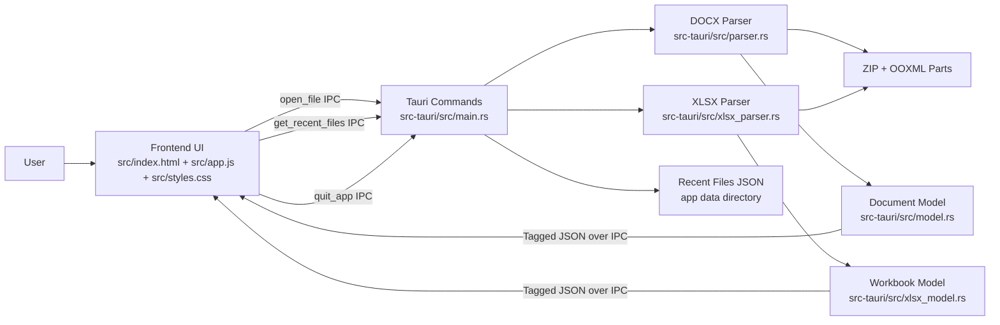

# Papyr Architecture

## Overview

Papyr is a read-only DOCX and XLSX viewer built as a Tauri desktop app with a Rust parsing backend and a vanilla HTML/CSS/JS frontend. The main runtime path is:

1. the frontend asks the Tauri backend to open a supported file
2. the Rust backend detects DOCX or XLSX and parses the OOXML ZIP package into a structured model
3. a tagged payload is serialized to JSON and returned over Tauri IPC
4. the frontend routes the payload to either the paginated DOCX renderer or spreadsheet grid renderer

The shipping desktop app uses the code under `src-tauri/`. The repository also contains a shared Rust crate at the repo root for parsing experiments and reusable types.

## Repository Layout

- `docs/SPEC.md`
  Product specification and feature intent.
- `docs/ARCHITECTURE.md`
  Architecture, development notes, and current limitations.
- `src/`
  Frontend shell, viewer UI, and styling used by the Tauri app.
- `src-rust/`
  Shared parser library and demo binary in the root crate.
- `src-tauri/`
  Tauri desktop app crate, commands, DOCX/XLSX parsers, and file models.
- `Cargo.toml`
  Root crate manifest.
- `config.yaml`
  Project configuration.

## Tech Stack

- Rust for parsing, data modeling, and desktop app logic
- Tauri 2 for the desktop shell
- `zip` and `quick-xml` for OOXML archive and XML parsing
- `serde` and `serde_json` for document model serialization
- vanilla HTML, CSS, and JavaScript for the frontend

## System Diagram



## Runtime Flow

### 1. App Startup

`src-tauri/src/main.rs` builds the Tauri app, installs the dialog and filesystem plugins, and registers the IPC commands. The main window starts hidden (`visible: false` in `tauri.conf.json`) to avoid showing a blank frame while the WebView2 runtime initializes on first launch.

The frontend initialization in `src/app.js` runs the following sequence:

1. set up event listeners, keyboard shortcuts, and drag-and-drop (synchronous)
2. load theme preference and recent files in parallel (`Promise.allSettled`)
3. call `show_main_window` to reveal the fully rendered window
4. check for a launch file path and load it if present

This means the user never sees a blank or partially rendered window. An inline script in `index.html` also applies the dark theme from `localStorage` before any paint to prevent a flash of the wrong theme.

In debug builds, the main webview opens devtools automatically.

### 2. File Selection and Loading

The frontend in `src/app.js` supports multiple entry points for loading a document:

- toolbar open button
- welcome-screen open button
- drag-and-drop via `tauri://drag-drop`
- recent files list

All of these converge on `loadDocument(path)`, which calls:

```js
invoke('open_file', { path })
```

The backend returns either `{ type: "docx", document: ... }` or `{ type: "xlsx", workbook: ... }`. The frontend routes this through `renderOpenedFile`.

### 3. DOCX Parsing

`DocxParser::from_path` in `src-tauri/src/parser.rs`:

- opens the selected file
- validates basic size constraints
- ensures `word/document.xml` exists
- preloads relationship metadata

`DocxParser::parse` assembles a `Document` by calling dedicated parsing stages:

- `parse_document_body`
- `parse_styles`
- `parse_comments`
- `parse_headers_footers`
- `parse_footnotes`
- `parse_images`

This keeps the parser organized around OOXML parts instead of handling everything in one pass.

### 4. XLSX Parsing

`XlsxParser::from_path` in `src-tauri/src/xlsx_parser.rs` opens and validates the workbook ZIP. `XlsxParser::parse` builds a fast preview model by reading:

- `xl/workbook.xml`
- `xl/_rels/workbook.xml.rels`
- `xl/sharedStrings.xml` when needed
- `xl/styles.xml` for basic number/date/text formats
- the active worksheet XML

The parser returns a sparse `XlsxWorkbook` model with sheet summaries and one loaded sheet. Additional sheets are loaded on demand through `open_xlsx_sheet`, so Papyr does not parse every sheet before showing the workbook.

The XLSX path is intentionally a preview path. It displays cached formula values when present, but does not evaluate formulas or render charts, pivots, macros, embedded objects, or full Excel-compatible layout.

### 5. IPC Boundary

Parsed Rust models are serialized through `serde` and sent to the frontend as tagged JSON. This model is the contract between backend and frontend.

For DOCX, the frontend assumes a tagged block model:

- `paragraph`
- `table`
- `page_break`

along with collections for comments, headers, footers, footnotes, styles, and images.

For XLSX, the frontend assumes a sparse workbook model:

- workbook sheet summaries
- active sheet rows
- sparse cells keyed by row and column indexes
- cell display values, raw values, value types, formulas, style indexes, and number formats
- preview limits and truncation metadata

### 6. Rendering

`renderDocument(doc)` in `src/app.js` drives the UI refresh. It:

- swaps from the welcome screen to the document view
- splits body content into pages on explicit page breaks
- renders each page
- renders comments
- updates the window title and find state

Rendering is mostly composed from these functions:

- `splitIntoPages`
- `renderPage`
- `renderBlocks`
- `renderParagraph`
- `renderRun`
- `renderTable`
- `renderComments`

Headers and footers are currently rendered per page using the first available header/footer entry in the model.

`renderWorkbook(workbook)` renders XLSX files as a spreadsheet preview:

- workbook title and dimensions
- sheet tabs
- sticky row and column headers
- sparse cell values in a grid
- truncation notices for large sheets

## Backend Architecture

### Tauri Command Layer

The backend command layer in `src-tauri/src/main.rs` is intentionally thin:

- `open_file` detects DOCX/XLSX, parses the file, and stores it in recent files
- `open_docx` remains available for compatibility with the existing DOCX command path
- `open_xlsx_sheet` parses one XLSX sheet on demand
- `get_recent_files` reads persisted history
- `get_launch_file_path` returns a supported launch path
- `show_main_window` reveals the window after the frontend is ready
- `quit_app` exits the application

This keeps parsing in dedicated parser modules and UI logic in the frontend.

### Parser Responsibilities

The DOCX parser is responsible for:

- opening the DOCX ZIP archive
- reading OOXML files by path
- resolving relationships for linked assets like images
- converting XML into a frontend-friendly `Document`
- failing with user-displayable error strings

Internally, the parser uses temporary context objects while walking XML, then converts them into stable model structs.

The XLSX parser is responsible for:

- opening the XLSX ZIP archive
- resolving workbook relationships
- reading shared strings only for referenced preview cells
- interpreting basic number/date/text formats
- producing sparse rows and cells
- applying row, column, and cell limits with visible truncation metadata

### DOCX Document Model

`src-tauri/src/model.rs` defines the central domain model:

- `Document`
- `BlockElement`
- `Run`
- `TableRow`
- `TableCell`
- `Comment`
- `HeaderFooter`
- `Footnote`
- `Style`

This model is the core architectural seam in the app. If the frontend changes, the parsing pipeline can remain mostly intact as long as this contract stays compatible.

### XLSX Workbook Model

`src-tauri/src/xlsx_model.rs` defines the spreadsheet preview model:

- `XlsxWorkbook`
- `XlsxSheetSummary`
- `XlsxSheet`
- `XlsxRow`
- `XlsxCell`
- `XlsxCellValueType`
- `XlsxPreviewLimits`

This model is intentionally sparse so large sheets do not allocate empty cells.

### Persistence

The only explicit app-level persistence in the current desktop app is the recent-files list. It is stored as JSON in the Tauri app data directory:

- file name: `recent-files.json`
- maximum entries: `8`

This persistence is managed entirely in `src-tauri/src/main.rs`.

## Frontend Architecture

### UI Structure

`src/index.html` defines three main UI regions:

- the header and toolbar
- the welcome screen and recent files area
- the document view with the desk and comments sidebar

It also includes a floating find bar.

### State Model

The frontend in `src/app.js` uses module-level mutable state instead of a framework store:

- `currentDocument`
- `currentWorkbook`
- `currentFilePath`
- `commentsVisible`
- `findMatches`
- `findIndex`
- `statusTimer`
- `findDebounceTimer`

For the current app size, this keeps the runtime simple and avoids introducing a build step or client framework.

### Rendering Strategy

The frontend renders directly into DOM nodes rather than using templates or a virtual DOM. The overall approach is:

- parse once on the backend
- render whole-page DOCX structures or XLSX grid structures in the frontend
- update the full view on each open or sheet switch

This is straightforward and easy to reason about, but it also means very large documents may eventually need incremental rendering or virtualization.

### Interaction Features

The frontend owns:

- keyboard shortcuts
- theme switching
- comment panel visibility
- in-document search and highlight navigation
- drag-and-drop affordances
- error and status banners

These behaviors are intentionally kept client-side because they mostly operate on already-loaded document state.

## Performance and Footprint

Papyr is intentionally built around a small runtime and a fairly direct rendering pipeline. There is not a separate recent "performance-only" change list in the visible git history, but the current codebase already includes several performance-oriented measures.

### Lightweight Runtime Choices

- The app uses Tauri and the system webview instead of shipping a heavier browser runtime.
- The frontend is plain HTML, CSS, and JavaScript, which avoids framework overhead and a frontend build step.
- The backend returns a compact `Document` JSON model that is already shaped for rendering, so the frontend does not need to do expensive OOXML interpretation work.

### Parser-Side Measures

- `DocxParser::from_path` and `XlsxParser::from_path` reject empty files and refuse files larger than `100 MB`, which prevents obviously pathological inputs from consuming excessive memory or CPU.
- Relationships are parsed once up front and cached in `self.relationships`, instead of reopening and reparsing the relationships file for each feature pass.
- The parser tracks `referenced_image_ids` while walking document content, then loads only the images that were actually referenced in the rendered document model.
- Unsupported EMF and WMF images are replaced with lightweight placeholder data URIs instead of attempting expensive conversion work in-process.
- OOXML parts are parsed with `quick-xml`'s event reader, which keeps parsing logic streaming-oriented and avoids building a full XML DOM in memory.
- Style inheritance is resolved once in Rust before the model reaches the frontend, which reduces repeated style lookup and merge work during rendering.
- The XLSX parser loads only the active sheet up front and loads other sheets on demand.
- The XLSX parser stores sparse rows and cells, caps preview rows, columns, and non-empty cells, and reports truncation metadata to the UI.
- Shared strings are streamed and only retained for string indexes referenced by preview cells.

### Startup Optimization

- The main window starts hidden and is only shown after the frontend has loaded theme and recent files data, eliminating the blank window flash during WebView2 cold start.
- Theme preference is applied from `localStorage` via an inline script in `<head>`, before any CSS paint occurs, which prevents a flash of the wrong theme.
- Theme and recent files load concurrently via `Promise.allSettled` to minimize time-to-visible.

### Frontend Measures

- Rendering uses `DocumentFragment` heavily and then appends batched content into the live DOM, which reduces repeated reflow and repaint work.
- The main document surface is cleared with `replaceChildren()` before a new render, which keeps updates simple and avoids incremental DOM churn from stale nodes.
- Page grouping is done once per open via `splitIntoPages(doc.body)`, rather than recalculating page structure repeatedly during interaction.
- In-document find is debounced by `120 ms`, which prevents a full highlight pass on every keystroke while the user is still typing.
- Recent files are deduplicated and capped at `8` entries, which keeps persistence small and quick to load.
- XLSX grid rendering caps DOM cells for very large loaded previews to keep the UI responsive.

### Tradeoffs and Remaining Gaps

- OOXML parts are still read into strings before parsing, so Papyr is not fully streaming end-to-end.
- The frontend currently rerenders the full document on open instead of virtualizing or incrementally updating very large documents.
- Images are embedded as data URIs for simple rendering, which is convenient but can increase payload size for image-heavy files.
- XLSX support is a fast preview path, not a full spreadsheet engine.

## Development Setup

### Prerequisites

You will need:

- Rust and Cargo
- Tauri development prerequisites for your platform
- on Windows, Microsoft Edge WebView2

If you do not already have the Tauri CLI installed:

```bash
cargo install tauri-cli
```

### Root Crate

The root crate contains shared parsing code and a small demo binary.

Run tests:

```bash
cargo test
```

Run the demo binary:

```bash
cargo run
```

### Desktop App

The desktop app lives in `src-tauri/` and uses the static frontend files in `src/`.

Check the desktop crate:

```bash
cargo check --manifest-path src-tauri/Cargo.toml
```

Build the desktop app:

```bash
cargo tauri build
```

You can also run that command from `src-tauri/`.

Do not use `cargo tauri build --manifest-path ...`. `cargo-tauri` does not expose Cargo's `--manifest-path` flag as a top-level option.

Do not use `cargo tauri build -- --manifest-path src-tauri/Cargo.toml` either. The `--` forwards arguments to the inner `cargo` invocation, which leads to an invalid relative manifest path in this repository layout.

The checked-in Tauri config currently includes:

- `frontendDist: ../src`
- `devUrl: http://localhost:1430`

That means `cargo tauri dev` currently expects a frontend dev server at `http://localhost:1430`. If development should use the checked-in static frontend instead, `src-tauri/tauri.conf.json` will need to be adjusted.

## Current Product Boundaries and Limitations

- Papyr is a viewer, not an editor.
- There is no support for editing or saving back to DOCX or XLSX.
- Papyr does not aim for full OOXML compatibility.
- Macros, embedded OLE content, charts, pivot tables, formula evaluation, and similar advanced document features are not supported.
- Pagination is driven by explicit page breaks rather than a full layout engine.
- Very large or structurally complex documents and workbooks may need graceful degradation in the renderer.
- The repository currently contains both a shared parser crate and a Tauri-specific parser implementation.
- The development flow around the Tauri dev configuration is still rough.

## Extension Points

If Papyr grows, the cleanest extension seams are:

- expanding the `Document` model in `src-tauri/src/model.rs`
- adding parser phases in `src-tauri/src/parser.rs`
- expanding the `XlsxWorkbook` model in `src-tauri/src/xlsx_model.rs`
- adding targeted worksheet features in `src-tauri/src/xlsx_parser.rs`
- introducing clearer frontend view modules around rendering and interaction concerns
- consolidating the shared parser logic so the desktop app and root crate do not drift

## Related Docs

- `README.md` for end-user installation and usage
- `docs/SPEC.md` for the product specification
